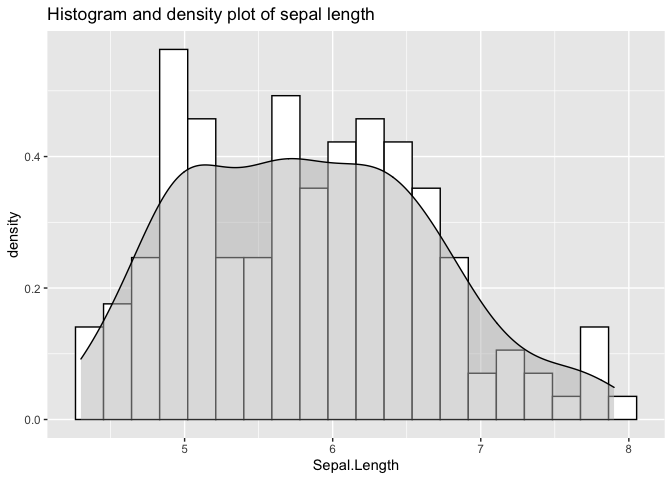

<!-- README.md is generated from README.Rmd. Please edit that file -->

# maggieliu545ba2

<!-- badges: start -->

<!-- badges: end -->

This package provides a function `plot_hist_with_density` that plots a
histogram of a column from a specified dataset, and a smooth density
curve overlayed on the histogram. The function allows for customizable
parameters for visualization.

## Installation

You can install `maggieliu545ba2` using

    devtools::install_github("stat545ubc-2021/maggieliu545ba2")

and load the package with

    library("maggieliu545ba2")

## Example

Below is an example of using the function `plot_hist_with_density`:

``` r
library(maggieliu545ba2)
(plot_hist_with_density(
  data=iris,
  column=Sepal.Length,
  xlab="Sepal Length",
  title="Histogram and density plot of sepal length"))
```


